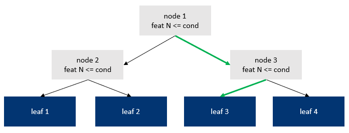
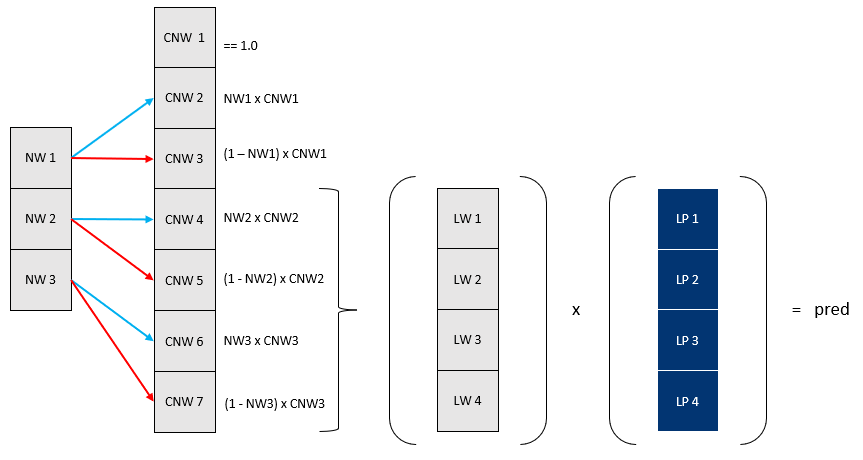

# NeuroTree - A differentiable tree operator for tabular data

## Overview

This work introduces `NeuroTree` a differentiable binary tree operator adapted for the treatment of tabular data. 

- Address the shortcoming of traditional trees greediness: all node and leaves are learned simultaneously. It provides the ability to learn an optimal configuration across all the tree levels. The notion extent also to the collection of trees that are simultaneously learned.

- Extend the notion of forest/bagging and boosting. 
    - Although the predictions from the all the trees forming a NeuroTree operator are averaged, each of the tree prediction is tuned simultaneously. This is different from boosting (ex XGBoost) where each tree is learned sequentially and over the residual from previous trees. Also, unlike random forest and bagging, trees aren't learned in isolation but tuned collaboratively, resulting in predictions that account for all of the other tree predictions.

- General operator compatible for composition.
    - Allows integration within Flux's Chain like other standard operators from NNLib. Composition is also illustrated through the built-in StackTree layer, a residual composition of multiple NeuroTree building blocks.

- Compatible with general purpose machine learning framework.
    - MLJ integration

## Architecture

A NeuroTree operator acts as collection of complete binary trees, ie. trees without any pruned node. To be differentiable, hence trainable using first-order gradient based methods (ex. Adam optimiser), each tree path implements a soft decision rather than a hard one like in traditional decision tree. 

To introduce the implementation of a NeuroTree, we first get back to the architecture of a basic decision tree.



The above is a binary decision tree of `depth` 2. 

Highlighted in green is the decision path taken for a given sample. It goes into `depth` number of binary decisions, resulting in the path `node1 → node3 → leaf3`.

One way to view the role of the decision nodes (gray background) is to provide an index of the leaf prediction to fetch (index `3` in the figure). Such indexing view is applicable given that node routing relies on hard conditions: either `true` or `false`. 

An alternative perspective that we adopt here is that tree nodes collectively provide weights associated to each leaf. A tree prediction becomes the weighted sum of the leaf's values and the leaf's weights.
In regular decision trees, since all conditions are binary, leaf weights take the form of a mask. In the above example, the mask is `[0, 0, 1, 0]`.

By relaxing these hard conditions into soft ones, the mask takes the form of a probability vector associated to each leaf, where `∑(leaf_weights) = 1` and where each each `leaf_weight` element is `[0, 1]`. A tree prediction can be obtained with the dot product: `leaf_values' *  leaf_weights`. 

The following illustrate how a basic decision tree is represented as a single differentiable tree within NeuroTree:



### Node weights

To illustrate how a NeuroTree derives the soft decision probability (referred to `NW1 - NW3` in the above figure), we first break down how a traditional tree split condition is derived from 2 underlying decisions:

1. *Selection of the feature on which to apply the condition*.
Such selection can be represented as the application of a binary mask where all elements are set to `false` except for that single selected feature where it's set to `true`.  

2. *Selection of the condition's threshold value*.
For a given observation, if the selected feature's value is below that threshold, then the node decision is set to `false` (pointing to left child), and `true` otherwise (pooinnting to right child).  

In NeuroTree, these 2 hard steps are translated into soft, differentiable ones. 

### Leaf weights

Computing the leaf weights consists of accumulating the weights through each tree branch. It's the technically more challenging part as such computation cannot be represented as a form of matrix multiplication, unlike other common operators like `Dense`, `Conv` or `MultiHeadAttention` / `Transformer`. Performing probability accumulation though a tree index naturally leads to in-place element wise operations, which are notoriously not friendly for auto-differentiation engines. 
Since NeuroTree was intended to integrate with the Flux.jl ecosystem, Zygote.jl acts as the underlying AD, the approach used was to manually implement `backward` / `adjoint` of the terminal leaf function and instruct the AD to use that custom rule rather than attempt to differentiate a non-AD compliant function. 

Below are the algo and actual implementation of the forward and backward function that compute the leaf weights. For brevity, the loops over each observation of the batch and each tree are omitted. Parallelism, both on CPU and GPU, is obtained through parallelization over the `tree` and `batch` dimensions. 

**Forward**

```julia
function leaf_weights!(nw)
    cw = ones(eltype(nw), 2 * size(nw, 1) + 1)

    for i = 2:2:size(cw, 1)
        cw[i] = cw[i>>1] * nw[i>>1]
        cw[i+1, tree, batch] = cw[i>>1] * (1 - nw[i>>1])
    end
    
    lw = cw[size(nw, 1)+1:size(cw, 1)]
    return (cw, lw)
end
```

**Backward**

```julia
function Δ_leaf_weights!(Δnw, ȳ, cw, nw, max_depth, node_offset)
    
    for i in axes(nw, 1)        
        depth = floor(Int, log2(i)) # current depth level - starting at 0
        step = 2^(max_depth - depth) # iteration length
        leaf_offset = step * (i - 2^depth) # offset on the leaf row

        for j = (1+leaf_offset):(step÷2+leaf_offset)
            k = j + node_offset # move from leaf position to full tree position 
            Δnw[i] += ȳ[j] * cw[k] / nw[i]
        end
    
        for j = (1+leaf_offset+step÷2):(step+leaf_offset)
            k = j + node_offset
            Δnw[i] -= ȳ[j] * cw[k] / (1 - nw[i])
        end
    end

    return nothing
end
```

### Tree prediction

## Composability

- StackTree
- General operator: Chain `NeuroTree` with MLP

## Benchmarks

For each dataset and algo, the following methodology is followed:
- Data is split in three parts: `train`, `eval` and `test`
- A random grid of 16 hyper-parameters is generated
- For each parameter configuration, a model is trained on `train` data until the evaluation metric tracked against the `eval` stops improving (early stopping)
- The trained model is evaluated against the `test` data
- The metric presented in below are the ones obtained on the `test` for the model that generated the best `eval` metric.

Source code available at [MLBenchmarks.jl](https://github.com/Evovest/MLBenchmarks.jl).

For performance assessment, benchmarks is run on the following selection of common Tabular datasets:
- [Year](https://archive.ics.uci.edu/dataset/203/yearpredictionmsd): min squared error regression. 515,345 observations, 90 features.
- [MSRank](https://www.microsoft.com/en-us/research/project/mslr/): ranking problem with min squared error regression. 1,200,192 observations, 136 features.
- [YahooRank](https://webscope.sandbox.yahoo.com/): ranking problem with min squared error regression. 709,877 observations, 519 features.
- [Higgs](https://archive.ics.uci.edu/dataset/280/higgs): 2-level classification with logistic regression. 11,000,000 observations, 28 features.
- [Boston Housing](https://juliaml.github.io/MLDatasets.jl/stable/datasets/misc/#MLDatasets.BostonHousing): min squared error regression. 506 observations, 13 features.
- [Titanic](https://juliaml.github.io/MLDatasets.jl/stable/datasets/misc/#MLDatasets.Titanic): 2-level classification with logistic regression. 891 observations, 7 features.

Comparison is performed against the following algos (implementation in link) considered as state of the art on classification tasks:
- [EvoTrees](https://github.com/Evovest/EvoTrees.jl)
- [XGBoost](https://github.com/dmlc/XGBoost.jl)
- [LightGBM](https://github.com/IQVIA-ML/LightGBM.jl)
- [CatBoost](https://github.com/JuliaAI/CatBoost.jl)
- [NODE](https://github.com/manujosephv/pytorch_tabular) (TODO)

#### Boston

| **model\_type** | **train\_time** | **mse** | **gini** |
|:---------------:|:---------------:|:-------:|:--------:|
| neurotrees      | 16.6            | **13.2**|**0.951** |
| evotrees        | 0.392           | 23.5    | 0.932    |
| xgboost         | 0.103           | 21.6    | 0.931    |
| lightgbm        | 0.406           | 26.7    | 0.931    |
| catboost        | 0.127           | 14.9    | 0.944    |

#### Titanic

| **model\_type** | **train\_time** | **logloss** | **accuracy** |
|:---------------:|:---------------:|:-----------:|:------------:|
| neurotrees      | 7.95            | 0.445       | 0.821        |
| evotrees        | 0.11            | 0.405       | 0.821        |
| xgboost         | 0.0512          | 0.412       | 0.799        |
| lightgbm        | 0.128           | **0.388**   | 0.828        |
| catboost        | 0.264           | 0.393       | **0.843**    |

#### Year

| **model\_type** | **train\_time** | **mse** | **gini** |
|:---------------:|:---------------:|:-------:|:--------:|
| neurotrees      | 308.0           | **76.8**| **0.651**|
| evotrees        | 71.9            | 80.4    | 0.626    |
| xgboost         | 33.8            | 82.0    | 0.614    |
| lightgbm        | 15.2            | 79.4    | 0.633    |
| catboost        | 127.0           | 80.2    | 0.630    |

#### MSRank

| **model\_type** | **train\_time** | **mse** | **ndcg** |
|:---------------:|:---------------:|:-------:|:--------:|
| neurotrees      | 85.1            | 0.577   | 0.467    |
| evotrees        | 39.8            | 0.554   | 0.505    |
| xgboost         | 19.4            | 0.554   | 0.501    |
| lightgbm        | 38.5            |**0.553**| **0.507**|
| catboost        | 112.0           |**0.553**| 0.504    |

#### Yahoo

| **model\_type** | **train\_time** | **mse** | **ndcg** |
|:---------------:|:---------------:|:-------:|:--------:|
| neurotrees      | 299.0           | 0.583   | 0.781    |
| evotrees        | 442.0           | 0.545   | 0.797    |
| xgboost         | 129.0           | 0.544   | 0.797    |
| lightgbm        | 215.0           |**0.539**| **0.798**|
| catboost        | 241.0           | 0.555   | 0.796    |

#### Higgs

| **model\_type** | **train\_time** | **logloss** | **accuracy** |
|:---------------:|:---------------:|:-----------:|:------------:|
| neurotrees      | 15900.0         | **0.453**   | **0.781**    |
| evotrees        | 2710.0          | 0.465       | 0.775        |
| xgboost         | 1390.0          | 0.464       | 0.776        |
| lightgbm        | 993.0           | 0.464       | 0.774        |
| catboost        | 8020.0          | 0.463       | 0.776        |


## Discussion

NeuroTreeModels can achieve top tier performance on both small (Boston) and large (Higgs) datasets. 
Its performance trailed on the two ranking regression problems (MSRank and Yahoo). Although the large number of features is a distinguishing characteristic of the Yahoo dataset, the 136 features of MSRank are not materially different for the YEAR dataset (90 features), and on which NeuroTreeMoels outperform all other algos. Considering that no sparsity mechanism is present in the feature selection for the node conditions, datasets with a very large number of features may present a challenge. Substituting the default `tanh` activation with a sparsity inducing one such as `hardsigmoid` or `EntrOpt` has not resulted
in improvement from the experiments. 

Another potential weakness may stem from the soft nature of the decision criteria. Traditional trees can isolate the effect of a specific feature value. This can be notably meaningful in a situation where a numeric feature taking a value of 0 may carry a particular meaning (ex. missing, unknown value). Such stump the effect of a feature should be harder to pick with NeuroTree's soft condition. 

## References

- [Neural Oblivious Decision Ensembles for Deep Learning on Tabular Data](https://arxiv.org/abs/1909.06312v2).
    - [https://github.com/Qwicen/node](https://github.com/Qwicen/node)
    - [https://github.com/manujosephv/pytorch_tabular](https://github.com/manujosephv/pytorch_tabular)
- [Attention augmented differentiable forest for tabular data](https://arxiv.org/abs/2010.02921)
- [NCART: Neural Classification and Regression Tree for Tabular Data](https://arxiv.org/abs/2307.12198)
- [Squeeze-and-Excitation Networks](https://arxiv.org/abs/1709.01507)
- [Deep Neural Decision Trees](https://arxiv.org/abs/1806.06988)
- [XGBoost: A Scalable Tree Boosting System](https://arxiv.org/abs/1603.02754)
- [CatBoost: gradient boosting with categorical features support](https://arxiv.org/abs/1810.11363)
- [LightGBM: A Highly Efficient Gradient Boosting Decision Tree](https://papers.nips.cc/paper_files/paper/2017/hash/6449f44a102fde848669bdd9eb6b76fa-Abstract.html)
- [Deep Neural Decision Trees](https://arxiv.org/abs/1806.06988)
- [Neural Decision Trees](https://arxiv.org/abs/1702.07360)
